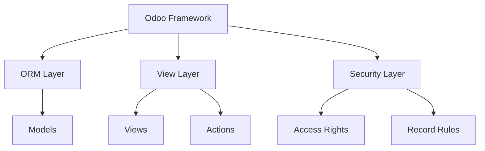

# 🎓 Complete Odoo Development Mastery Guide
## Real-World College ERP Project - Step by Step

### 📊 Project Overview
We're building a **College Management System** that demonstrates all core Odoo concepts. This is a production-ready ERP system with real-world complexity.

---

## 🚀 Phase 1: Foundation & Setup

### 1.1 Understanding Odoo Architecture


### 1.2 Module Structure Analysis
```
college_erp/
├── __manifest__.py          # Module metadata
├── models/                  # Data models (MVC)
│   ├── __init__.py
│   ├── college_student.py   # Student management
│   ├── college_course.py    # Course management
│   ├── college_faculty.py   # Faculty management
│   └── college_department.py # Department management
├── views/                   # User interface
│   └── erp_view.xml        # Form, tree, search views
├── security/               # Access control
│   └── ir.model.access.csv # Permission matrix
└── static/                # Assets
    └── description/       # Module documentation
```

---

## 🏗️ Phase 2: Core Model Development

### 2.1 Student Model Deep Dive
Let's analyze the college_student.py file:

```python
# -*- coding: utf-8 -*-
from odoo import models, fields

class CollegeStudent(models.Model):
    _name = 'college.student'           # Database table name
    _description = 'College Student'   # User-friendly description
    
    # Basic Information
    name = fields.Char(string='Name', required=True)
    student_id = fields.Char(string='Student ID', required=True)
    
    # Contact Information
    email = fields.Char(string='Email')
    phone = fields.Char(string='Phone')
    
    # Personal Details
    date_of_birth = fields.Date(string='Date of Birth')
    admission_date = fields.Date(string='Admission Date')
    
    # Relational Fields
    course_id = fields.Many2one('college.course', string='Course')
    department_id = fields.Many2one('college.department', string='Department')
```

### 2.2 Field Types Explained

| Field Type | Purpose | Example |
|------------|---------|---------|
| `Char` | Short text | name, student_id |
| `Date` | Date values | date_of_birth |
| `Many2one` | Foreign key relationship | course_id → college.course |
| `Integer` | Whole numbers | age, credits |
| `Float` | Decimal numbers | gpa, fees |
| `Boolean` | True/False | is_active, is_scholarship |
| `Selection` | Dropdown choices | gender, status |

---

## 🔗 Phase 3: Advanced Model Relationships

### 3.1 Enhanced Student Model
Let's expand the student model with advanced features:

<create_file>
<path>models/college_student_enhanced.py</path>
<content>
# -*- coding: utf-8 -*-
from odoo import models, fields, api
from datetime import datetime

class CollegeStudent(models.Model):
    _name = 'college.student'
    _description = 'College Student'
    _inherit = ['mail.thread', 'mail.activity.mixin']  # Enable chatter
    
    # Basic Information
    name = fields.Char(string='Name', required=True, tracking=True)
    student_id = fields.Char(string='Student ID', required=True, copy=False)
    image = fields.Binary(string='Photo')
    
    # Personal Details
    first_name = fields.Char(string='First Name')
    last_name = fields.Char(string='Last Name')
    email = fields.Char(string='Email', required=True)
    phone = fields.Char(string='Phone')
    mobile = fields.Char(string='Mobile')
    
    # Demographics
    date_of_birth = fields.Date(string='Date of Birth')
    age = fields.Integer(string='Age', compute='_compute_age')
    gender = fields.Selection([
        ('male', 'Male'),
        ('female', 'Female'),
        ('other', 'Other')
    ], string='Gender')
    
    # Academic Information
    admission_date = fields.Date(string='Admission Date', default=fields.Date.today)
    graduation_date = fields.Date(string='Expected Graduation Date')
    current_semester = fields.Integer(string='Current Semester', default=1)
    cgpa = fields.Float(string='CGPA', digits=(3, 2))
    
    # Relational Fields
    course_id = fields.Many2one('college.course', string='Course', required=True)
    department_id = fields.Many2one('college.department', string='Department', 
                                   related='course_id.department_id', store=True)
    faculty_id = fields.Many2one('college.faculty', string='Advisor')
    
    # One2many Fields (Reverse relationships)
    enrollment_ids = fields.One2many('college.enrollment', 'student_id', string='Enrollments')
    attendance_ids = fields.One2many('college.attendance', 'student_id', string='Attendance')
    fee_ids = fields.One2many('college.fee', 'student_id', string='Fee Records')
    
    # Computed Fields
    total_credits = fields.Integer(string='Total Credits', compute='_compute_total_credits')
    attendance_percentage = fields.Float(string='Attendance %', compute='_compute_attendance')
    
    # Status
    state = fields.Selection([
        ('draft', 'Draft'),
        ('admitted', 'Admitted'),
        ('studying', 'Studying'),
        ('graduated', 'Graduated'),
        ('dropped', 'Dropped')
    ], string='Status', default='draft', tracking=True)
    
    # SQL Constraints
    _sql_constraints = [
        ('student_id_unique', 'unique(student_id)', 'Student ID must be unique!'),
        ('email_unique', 'unique(email)', 'Email must be unique!')
    ]
    
    # Compute Methods
    @api.depends('date_of_birth')
    def _compute_age(self):
        for student in self:
            if student.date_of_birth:
                today = datetime.today()
                student.age = today.year - student.date_of_birth.year - (
                    (today.month, today.day) < (student.date_of_birth.month, student.date_of_birth.day)
                )
            else:
                student.age = 0
    
    @api.depends('enrollment_ids.credits')
    def _compute_total_credits(self):
        for student in self:
            student.total_credits = sum(student.enrollment_ids.mapped('credits'))
    
    @api.depends('attendance_ids.status')
    def _compute_attendance(self):
        for student in self:
            total_classes = len(student.attendance_ids)
            if total_classes > 0:
                present_classes = len(student.attendance_ids.filtered(lambda x: x.status == 'present'))
                student.attendance_percentage = (present_classes / total_classes) * 100
            else:
                student.attendance_percentage = 0
    
    # CRUD Methods
    def action_admit(self):
        self.state = 'admitted'
    
    def action_graduate(self):
        self.state = 'graduated'
    
    def action_drop(self):
        self.state = 'dropped'
    
    # Name Getters
    def name_get(self):
        result = []
        for student in self:
            name = f"{student.student_id} - {student.name}"
            result.append((student.id, name))
        return result
    
    # Constraints
    @api.constrains('email')
    def _check_email(self):
        for student in self:
            if student.email and '@' not in student.email:
                raise ValidationError('Please enter a valid email address')
